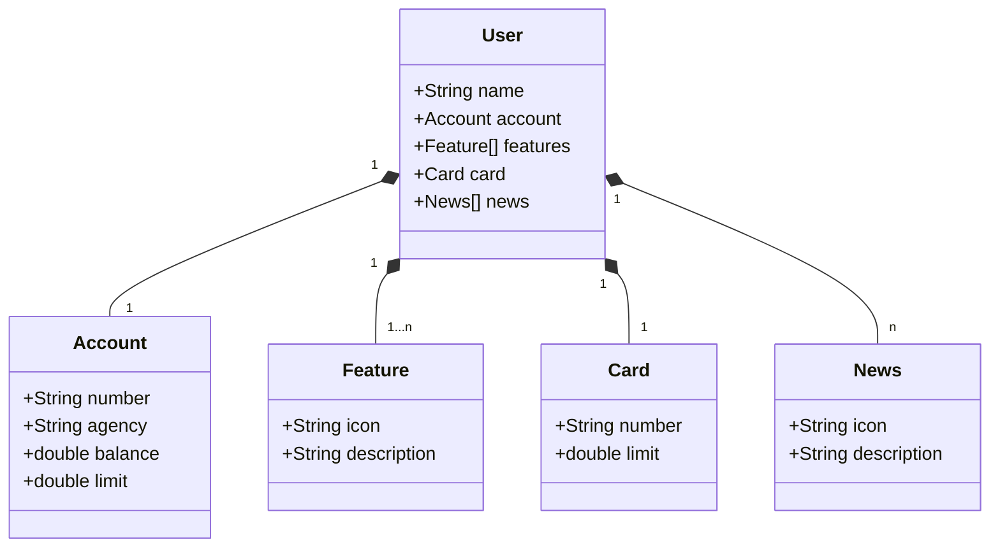

# Santander Dev Week 2023
Java RESTful API criada para a Santander Dev Week

## Principais Tecnologias
* Java 17: Utilizaremos a versão LTS mais recente do Java para tirar vantagem das últimas inovações que essa linguagem robusta e amplamente utilizada oferece;
* Spring Boot 3: Trabalharemos com a mais nova versão do Spring Boot, que maximiza a produtividade do desenvolvedor por meio de sua poderosa premissa de autoconfiguração;
* Spring Data JPA: Exploraremos como essa ferramenta pode simplificar nossa camada de acesso aos dados, facilitando a integração com bancos de dados SQL;
* OpenAPI (Swagger): Vamos criar uma documentação de API eficaz e fácil de entender usando a OpenAPI (Swagger), perfeitamente alinhada com a alta produtividade que o Spring Boot oferece;
* Railway: facilita o deploy e monitoramento de nossas soluções na nuvem, além de oferecer diversos bancos de dados como serviço e pipelines de CI/CD.

## Diagrama de Classes

### IMPORTANTE
Projeto do falvojr, construído durante bootcamp da Dio - Desenvolvimento Java com IA.

O projeto foi disponibilizado na nuvem, através do Railway. Para acessar o swagger do projeto basta clicar no link a seguir:

https://santander-dev-week-2023-production-540a.up.railway.app/swagger-ui/index.html